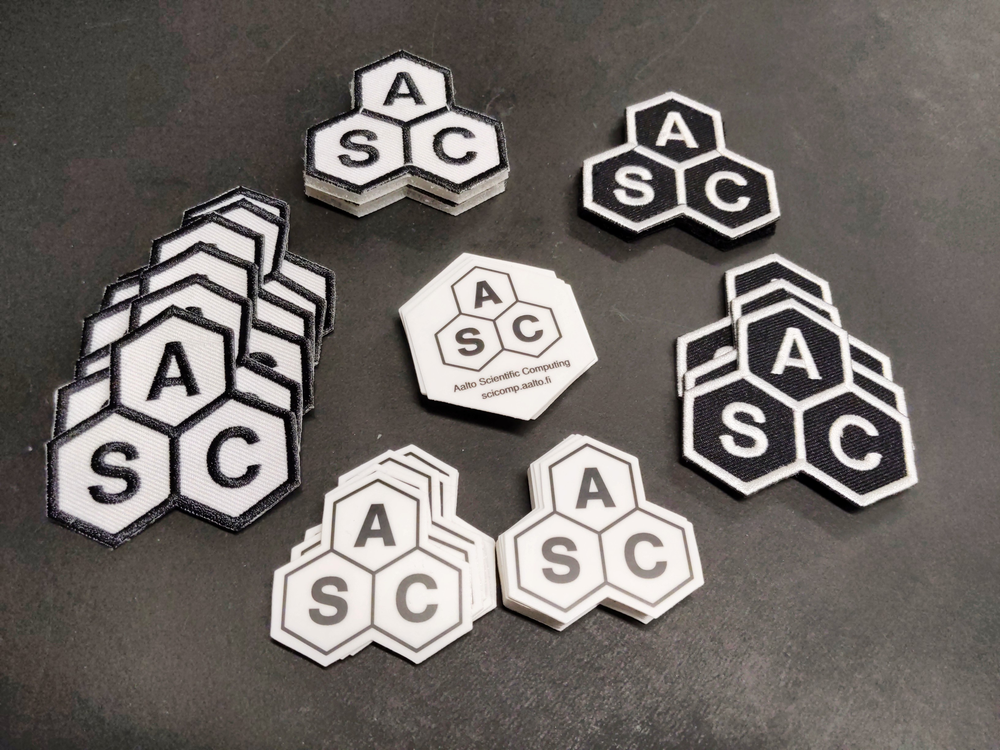

:blogpost: true
:date: 2023-02-20
:author: AUTHOR
:category: ASC

Aalto SciComp stickers and patches
==================================

We have stickers (and patches!) to support Aalto Scientific Computing.
(You can get them from our IT offices in CS, NBE, and Physics) But why
invest in this?  Well, it's fun, but there should be a deeper reason.

   Stickers and patches, pick up from either the Physics, Neuroscience
   and Biomedical Engineering, or Computer Science.

It's our goal to make not just provide a computer cluster, courses,
and support.  That's great, but we can't scale to solve all problems:
the only way we can provide the environment that we want is if the
whole community can work together.  Thus, our new promotional material
is designed so that the community can show it's support of scientific
computing at Aalto University.  We hope that by providing a way for
the community to show this interest, people can find - and support -
each other better.

We have the typical stickers, which you can use on all the typical
sticker things.

We also have patches, for those who are interested - in Finland they
are a big thing on [student
overalls](https://en.wikipedia.org/wiki/Student_boilersuit), though
maybe they aren't the biggest thing anymore for our main audience.

Black background vs white background?
-------------------------------------

You may notice that for the patches some have a black background and
some have a white background.  **Black-background means "Ask me
anything about the tools of scientific computing, I am happy to
help or at least point you the right direction (as much as I can)!"**

Here's our idea:

* Anyone may take the white background ones
* Black background is for:

  * Aalto Scientific Computing team staff
  * Volunteers at our events (for example helpers at our workshops)
  * **Anyone who is interested in using their time to help others in
    scientific computing (regardless of their skills)**

(clever people will notice that the first two are included in the
third, and actually anyone can be the third if they want).

The idea is that we, and our community, can't work alone.  Everyone
needs to support each other in order to work at the level we want.
The in-group experts are an undervalued resource in this, often not
getting the credit or recognition they deserve in supporting
everyone.  This is our small method of recognizing those supporters,
and we hope that in the future we support them ever more - both
career-wise and supporting them in supporting others.

Yes, we should have gotten black-background stickers.  We'll do that
next time...
